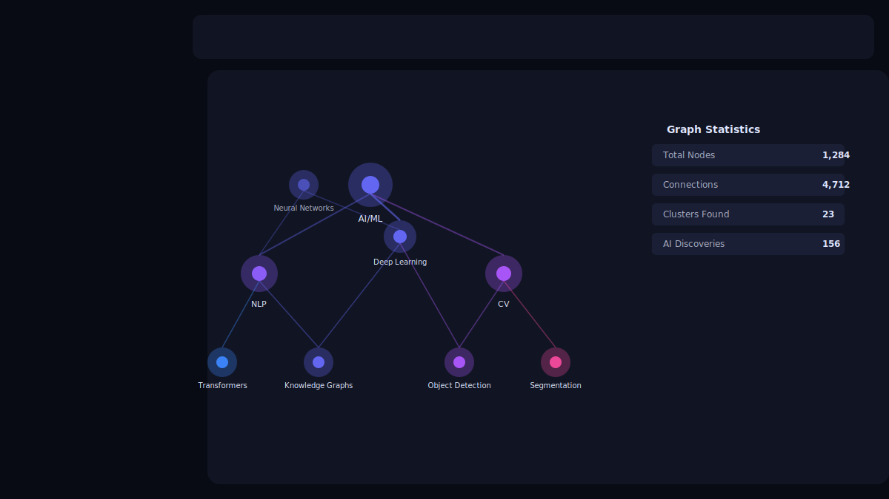
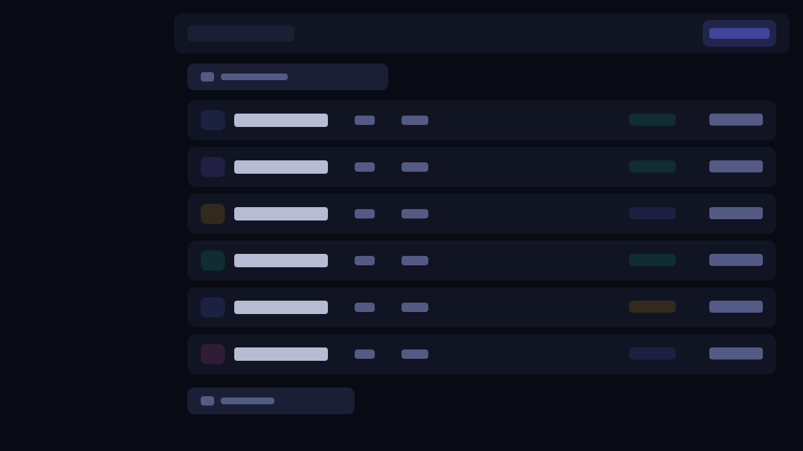
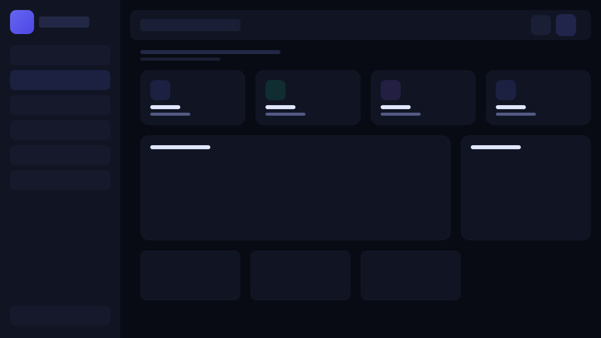

<p align="center">
  <picture>
    <source media="(prefers-color-scheme: dark)" srcset="screenshots/dashboard.svg">
   
  </picture>
</p>

<p align="center">
  <h1 align="center">CogniSync 🧠</h1>
  <p align="center"><em>AI-Powered Second Brain — Transform Ideas into Actionable Intelligence</em></p>
</p>

<p align="center">
  <a href="https://nextjs.org/"></a>
  <a href="https://fastapi.tiangolo.com/"></a>
  <a href="https://www.python.org/"></a>
  <a href="https://www.typescriptlang.org/"></a>
  <a href="https://tailwindcss.com/"></a>
  <a href="https://spacy.io/"></a>
  <a href="https://www.postgresql.org/"></a>
  <a href="https://www.docker.com/"></a>
  <a href="LICENSE"></a>
</p>

<p align="center">
  <a href="#-overview">Overview</a> •
  <a href="#-key-features">Features</a> •
  <a href="#-architecture">Architecture</a> •
  <a href="#-getting-started">Getting Started</a> •
  <a href="#-api-reference">API</a> •
  <a href="#-deployment">Deployment</a> •
  <a href="#-faq">FAQ</a>
</p>

<br>

## 📋 Overview

CogniSync is a production-grade AI knowledge management platform. It ingests notes, documents, and tasks; extracts entities and relationships using NLP; visualizes them as an interactive knowledge graph; and prioritizes work using a context-aware scoring engine.

**The problem:** Knowledge workers lose ~30% of their ideas, context-switch between fragmented tools, and lack a unified system for connecting information.

**The approach:** A modular monolith with an async Python backend (FastAPI + SQLAlchemy), a React frontend (Next.js 14 App Router), and a local-first AI stack (spaCy, Transformers, OpenCV) that requires no external API calls for core functionality.

---

## ✨ Key Features

<table>
  <tr>
    <td width="50%">
      <h3>📝 Smart Notes</h3>
      <ul>
        <li><strong>Entity extraction</strong> — spaCy NER identifies people, orgs, concepts, technologies, and locations</li>
        <li><strong>Extractive summarization</strong> — TF-IDF sentence scoring pulls the top-N most informative sentences</li>
        <li><strong>Sentiment analysis</strong> — TextBlob polarity scoring (positive/negative/neutral)</li>
        <li><strong>Auto-tagging</strong> — Keyword matching against 5 domain topic clusters</li>
        <li><strong>Cross-note linking</strong> — Shared entities create implicit edges between notes</li>
      </ul>
    </td>
    <td width="50%">
      
    </td>
  </tr>
  <tr>
    <td width="50%">
      
    </td>
    <td width="50%">
      <h3>🔗 Knowledge Graph</h3>
      <ul>
        <li><strong>Force-directed layout</strong> — Pure SVG with no WebGL dependency; 60fps up to ~2000 nodes</li>
        <li><strong>Entity resolution</strong> — Deduplicated nodes from extracted entities across all notes</li>
        <li><strong>Weighted edges</strong> — Connection strength derived from entity relevance × co-occurrence frequency</li>
        <li><strong>Interactive exploration</strong> — Pan, zoom, hover highlight, neighbor isolation</li>
        <li><strong>Real-time stats</strong> — Node count, edge density, AI discovery metrics</li>
      </ul>
    </td>
  </tr>
  <tr>
    <td width="50%">
      <h3>✅ Smart Tasks</h3>
      <ul>
        <li><strong>Priority scoring</strong> — Weighted combination of deadline proximity, manual priority, and estimated effort</li>
        <li><strong>Quick-win boosting</strong> — Tasks estimated ≤15 min receive a +0.15 score bonus</li>
        <li><strong>Time-window escalation</strong> — Due within 24h (+0.30) or 72h (+0.15)</li>
        <li><strong>Explainable AI</strong> — Each score includes a human-readable reasoning string</li>
        <li><strong>Status lifecycle</strong> — todo → in_progress → done with timestamps</li>
      </ul>
    </td>
    <td width="50%">
      
    </td>
  </tr>
  <tr>
    <td width="50%">
      
    </td>
    <td width="50%">
      <h3>📄 Document Intelligence</h3>
      <ul>
        <li><strong>OCR pipeline</strong> — OpenCV preprocessing (grayscale → thresholding) → Tesseract text extraction</li>
        <li><strong>Auto-classification</strong> — Filename keyword matching against 6 document categories</li>
        <li><strong>Status tracking</strong> — pending → processing → analyzed/error with retry capability</li>
        <li><strong>Format support</strong> — PDF, PNG, JPG, TIFF, DOCX, XLSX</li>
        <li><strong>Size limit</strong> — Configurable max upload (default 50 MB)</li>
      </ul>
    </td>
  </tr>
</table>

### 🤖 AI Assistant

| Capability | Implementation | Latency |
|------------|---------------|---------|
| Entity extraction | spaCy `en_core_web_sm` | ~50ms / 1KB text |
| Summarization | TF-IDF sentence ranking | ~30ms / 1KB text |
| Sentiment | TextBlob polarity | ~10ms / 1KB text |
| Text similarity | `all-MiniLM-L6-v2` embeddings | ~100ms / 1KB text |
| OCR | OpenCV + Tesseract 5 | ~500ms per image |
| Document classification | Regex keyword matching | ~5ms per filename |
| Chat responses | Rule-based intent matching | ~5ms per message |

> **Note:** All AI features run locally — zero external API dependencies for the core stack. Optional OpenAI key can be used for enhanced LLM responses.

---

## 🏗️ Architecture

### System Diagram

```
┌──────────────────────────────────────────────────────────────────┐
│                        CLIENT LAYER                               │
│  ┌────────────────────────────────────────────────────────────┐  │
│  │              Next.js 14 (App Router)                        │  │
│  │  ┌──────────┐ ┌──────────┐ ┌──────────┐ ┌──────────────┐  │  │
│  │  │Dashboard │ │  Notes   │ │  Graph   │ │  Documents   │  │  │
│  │  │  Page    │ │  Page    │ │  Page    │ │    Page      │  │  │
│  │  └──────────┘ └──────────┘ └──────────┘ └──────────────┘  │  │
│  │  ┌──────────────────────────────────────────────────────┐  │  │
│  │  │     UI: Tailwind CSS · Framer Motion · Recharts      │  │  │
│  │  └──────────────────────────────────────────────────────┘  │  │
│  └────────────────────────────────────────────────────────────┘  │
├──────────────────────────────────────────────────────────────────┤
│                        API GATEWAY                                │
│  ┌────────────────────────────────────────────────────────────┐  │
│  │              FastAPI · Uvicorn · CORS                        │  │
│  │  ┌──────────┐ ┌──────────┐ ┌──────────┐ ┌──────────────┐  │  │
│  │  │  Auth    │ │  Notes   │ │  Tasks   │ │  Documents   │  │  │
│  │  │ /auth/*  │ │ /notes/* │ │ /tasks/* │ │ /documents/* │  │  │
│  │  └──────────┘ └──────────┘ └──────────┘ └──────────────┘  │  │
│  │  ┌──────────────────────────────────────────────────────┐  │  │
│  │  │       Graph (/graph/*) · AI (/ai/*)                   │  │  │
│  │  └──────────────────────────────────────────────────────┘  │  │
│  └────────────────────────────────────────────────────────────┘  │
├──────────────────────────────────────────────────────────────────┤
│                       SERVICE LAYER                                │
│  ┌────────────────────────────────────────────────────────────┐  │
│  │  ┌──────────────┐ ┌──────────────┐ ┌──────────────────┐  │  │
│  │  │ AuthService   │ │ NoteService  │ │ TaskService      │  │  │
│  │  │ (JWT+bcrypt)  │ │ (CRUD+AI)    │ │ (Scoring+CRUD)   │  │  │
│  │  └──────────────┘ └──────────────┘ └──────────────────┘  │  │
│  │  ┌────────────────┐ ┌────────────────────────────────┐    │  │
│  │  │ GraphService    │ │ DocumentService                │    │  │
│  │  │ (Entity→Node)   │ │ (Upload+OCR+Classify)          │    │  │
│  │  └────────────────┘ └────────────────────────────────┘    │  │
│  └────────────────────────────────────────────────────────────┘  │
├──────────────────────────────────────────────────────────────────┤
│                        AI LAYER                                    │
│  ┌────────────────────────────────────────────────────────────┐  │
│  │  ┌──────────────┐ ┌──────────────┐ ┌──────────────────┐  │  │
│  │  │  NLPService  │ │ VisionService│ │ Recommender      │  │  │
│  │  │  · spaCy NER │ │ · OpenCV     │ │ · Sentence-BERT  │  │  │
│  │  │  · TextBlob  │ │ · Tesseract  │ │ · Jaccard sim    │  │  │
│  │  │  · TF-IDF    │ │ · Classifier │ │ · Tag suggester  │  │  │
│  │  └──────────────┘ └──────────────┘ └──────────────────┘  │  │
│  └────────────────────────────────────────────────────────────┘  │
├──────────────────────────────────────────────────────────────────┤
│                       DATA LAYER                                   │
│  ┌────────────────────────────────────────────────────────────┐  │
│  │  ┌────────────┐ ┌──────────┐ ┌──────────┐ ┌────────────┐  │  │
│  │  │ PostgreSQL │ │  Redis   │ │  Neo4j   │ │  File      │  │  │
│  │  │  (Primary) │ │ (Cache)  │ │ (Graph)  │ │  Store     │  │  │
│  │  └────────────┘ └──────────┘ └──────────┘ └────────────┘  │  │
│  └────────────────────────────────────────────────────────────┘  │
└──────────────────────────────────────────────────────────────────┘
```

### Design Decisions

| Decision | Rationale | Trade-off |
|----------|-----------|-----------|
| **FastAPI over Django** | Native async, automatic OpenAPI, pydantic validation | No built-in admin panel or ORM |
| **Next.js App Router** | RSC for static content, CSR for interactive graph, API routes for BFF | Bundle splitting requires discipline |
| **SQLAlchemy async** | Non-blocking DB I/O during AI inference | Migration tooling (Alembic) is verbose |
| **SVG graph over Canvas/WebGL** | Zero dependencies, accessible, inspectable DOM elements | Slower past ~5000 nodes |
| **Local AI over API calls** | Zero latency, no cost, offline-capable, no data leakage | Smaller model capacity vs GPT-4 |
| **JWT over sessions** | Stateless auth, no DB lookup on each request | Token revocation requires a blacklist |

### Data Model (Core Entities)

```
User (1) ──< (N) Note (1) ──< (N) NoteEntity
  │
  ├── (N) Task
  └── (N) Document
```

| Entity | Key Fields | Purpose |
|--------|-----------|---------|
| `User` | id, email, hashed_password, name | Auth and ownership |
| `Note` | id, title, content, summary, sentiment, is_analyzed | User-authored content with AI metadata |
| `NoteEntity` | id, name, entity_type, relevance, note_id | Extracted entities linked to source note |
| `Task` | id, title, description, priority, status, due_date, ai_score | Actionable items with AI scoring |
| `Document` | id, filename, file_type, file_size, status, ocr_text, classification | Uploaded files with processing pipeline |

---

## 🛠️ Tech Stack

| Layer | Technology | Version | Role |
|-------|-----------|---------|------|
| **Frontend framework** | Next.js | 14.2 | SSR, CSR, API routes |
| **UI runtime** | React | 18.3 | Component model |
| **Language** | TypeScript | 5.4 | Type safety |
| **Styling** | Tailwind CSS | 3.4 | Utility-first CSS |
| **Animation** | Framer Motion | 11.0 | Declarative animations |
| **Charts** | Recharts | 2.12 | Responsive SVG charts |
| **Icons** | Lucide React | 0.350 | Consistent icon system |
| **Auth client** | NextAuth.js | 4.24 | JWT + OAuth |
| **HTTP client** | Fetch (native) | — | Typed API client |
| **Backend framework** | FastAPI | 0.115 | Async Python web framework |
| **ASGI server** | Uvicorn | 0.30 | Production ASGI server |
| **ORM** | SQLAlchemy | 2.0 | Async ORM with Alembic |
| **Validation** | Pydantic | 2.9 | Request/response schemas |
| **Auth** | python-jose + passlib | 3.3 / 1.7 | JWT + bcrypt hashing |
| **NLP** | spaCy | 3.7 | NER, dependency parsing |
| **NLP** | TextBlob | 0.18 | Sentiment analysis |
| **NLP** | NLTK | 3.9 | Tokenization |
| **Embeddings** | sentence-transformers | 3.0 | Text similarity |
| **ML framework** | PyTorch | 2.4 | Backend for transformers |
| **Vision** | OpenCV | 4.10 | Image preprocessing |
| **OCR** | pytesseract | 0.13 | Text extraction |
| **Numerical** | numpy | 1.26 | Array operations |
| **ML** | scikit-learn | 1.5 | TF-IDF vectorization |
| **Graph** | networkx | 3.3 | Graph algorithms (fallback) |
| **Database** | PostgreSQL | 16 | Primary data store |
| **Cache** | Redis | 7 | Session store |
| **Graph DB** | Neo4j | 5 | Graph storage (optional) |
| **Container** | Docker | 24+ | Runtime environment |
| **Orchestration** | Docker Compose | 2.24 | Multi-service orchestration |

---

## 🚀 Getting Started

### Prerequisites

| Dependency | Minimum Version | Check Command |
|-----------|----------------|---------------|
| Node.js | 18.x | `node --version` |
| npm | 9.x | `npm --version` |
| Python | 3.11 | `python --version` |
| PostgreSQL | 16 | `psql --version` |
| Redis | 7 | `redis-cli --version` |
| Tesseract | 5.0 | `tesseract --version` |
| Docker | 24+ | `docker --version` |

### Installation

```bash
# Clone
git clone https://github.com/augsatr/-CogniSync-AI-Powered-Second-Brain.git
cd cognisync

# Environment
cp .env.example .env
# Required: SECRET_KEY, DATABASE_URL, REDIS_URL
```

#### Frontend

```bash
cd frontend
npm install
npm run dev    # → http://localhost:3000
```

#### Backend

```bash
cd backend
python -m venv venv
source venv/bin/activate  # Windows: venv\Scripts\Activate.ps1
pip install -r requirements.txt
python -m spacy download en_core_web_sm
# ⚠ Requires Tesseract OCR installed separately:
#   macOS: brew install tesseract
#   Ubuntu: apt install tesseract-ocr
#   Windows: https://github.com/UB-Mannheim/tesseract/wiki

uvicorn app.main:app --reload --port 8000  # → http://localhost:8000
```

#### Docker (all services)

```bash
docker-compose up -d --build
# Frontend: http://localhost:3000
# Backend:  http://localhost:8000
# API Docs: http://localhost:8000/docs
# Neo4j:    http://localhost:7474 (neo4j/password)
```

### Environment Variables

| Variable | Required | Default | Description |
|----------|----------|---------|-------------|
| `SECRET_KEY` | ✅ | — | JWT signing key (min 32 chars) |
| `NEXTAUTH_SECRET` | ✅ | — | NextAuth.js encryption key |
| `DATABASE_URL` | ✅ | `postgresql+asyncpg://...` | Async PostgreSQL connection string |
| `REDIS_URL` | ✅ | `redis://localhost:6379/0` | Redis connection string |
| `NEXT_PUBLIC_API_URL` | ✅ | `http://localhost:8000/api` | Frontend API base URL |
| `GOOGLE_CLIENT_ID` | ❌ | — | Google OAuth client ID |
| `GOOGLE_CLIENT_SECRET` | ❌ | — | Google OAuth client secret |
| `OPENAI_API_KEY` | ❌ | — | Optional LLM enhancement |
| `NEO4J_URI` | ❌ | `bolt://localhost:7687` | Neo4j connection (optional) |
| `MAX_UPLOAD_SIZE_MB` | ❌ | `50` | Max document upload size |

---

## 📖 API Reference

All endpoints are prefixed with `/api`. Full interactive documentation at `/docs` (Swagger UI) and `/redoc` (ReDoc).

### Authentication

```
POST /api/auth/register    { email, password, name }     → 201 { access_token, user }
POST /api/auth/login       { email, password }           → 200 { access_token, user }
GET  /api/auth/me          [Bearer Token]                → 200 { user }
```

All protected endpoints require: `Authorization: Bearer <token>`

### Notes

```
GET    /api/notes          → 200 [ { id, title, content, summary, entities, ... } ]
POST   /api/notes          → 201 { id, title, ... }          Body: { title, content?, tags? }
GET    /api/notes/:id      → 200 { note with entities }
POST   /api/notes/:id/analyze → 200 { entities[], summary, sentiment }
DELETE /api/notes/:id      → 204
```

### Tasks

```
GET    /api/tasks              → 200 [ { id, title, priority, ai_score, ... } ]
POST   /api/tasks              → 201 { task }                Body: { title, description?, priority?, due_date? }
GET    /api/tasks/:id          → 200 { task }
POST   /api/tasks/:id/prioritize → 200 { task, ai_priority_score, reasoning }
PATCH  /api/tasks/:id/status   → 200 { task }                Query: ?status=todo|in_progress|done
```

### Documents

```
GET    /api/documents           → 200 [ { id, filename, status, ... } ]
POST   /api/documents/upload    → 201 { id, filename, status }  Body: multipart/form-data { file }
GET    /api/documents/:id       → 200 { document }
POST   /api/documents/:id/analyze → 200 { document with ocr_text, summary, classification }
```

### Knowledge Graph

```
GET /api/graph  → 200 { nodes: [{ id, label, type, weight }], edges: [{ source, target, weight }] }
```

### AI

```
POST /api/ai/analyze  { text }  → 200 { entities[], summary, sentiment }
POST /api/ai/chat     { message } → 200 { response }
```

### Error Format

```json
{
  "detail": "Human-readable error message"
}
```

HTTP status codes: `200` success, `201` created, `204` no content, `401` unauthorized, `404` not found, `409` conflict, `413` payload too large, `422` validation error, `500` server error.

---

## 📂 Project Structure

```
cognisync/
├── frontend/
│   ├── app/                          # Next.js App Router
│   │   ├── dashboard/
│   │   │   ├── notes/page.tsx        # Smart Notes view
│   │   │   ├── graph/page.tsx        # Knowledge Graph view
│   │   │   ├── tasks/page.tsx        # Smart Tasks view
│   │   │   ├── documents/page.tsx    # Document Intelligence
│   │   │   ├── layout.tsx            # Dashboard shell (sidebar + header)
│   │   │   └── page.tsx              # Dashboard homepage
│   │   ├── login/page.tsx            # Auth page (sign in / sign up)
│   │   ├── api/auth/[...nextauth]/   # NextAuth.js API route
│   │   ├── layout.tsx                # Root layout with providers
│   │   ├── page.tsx                  # Landing page
│   │   └── globals.css               # Tailwind directives + glassmorphism
│   ├── components/
│   │   ├── ui/                       # Reusable primitives
│   │   │   ├── button.tsx            # Multi-variant button
│   │   │   ├── card.tsx              # Glassmorphic card
│   │   │   ├── glass-card.tsx        # Backdrop-blur card
│   │   │   └── input.tsx             # Themed input
│   │   ├── dashboard/                # Domain components
│   │   │   ├── sidebar.tsx           # Navigation + branding
│   │   │   ├── header.tsx            # Global search + user menu
│   │   │   ├── stats-card.tsx        # Metric with trend indicator
│   │   │   ├── activity-feed.tsx     # Real-time event stream
│   │   │   └── knowledge-graph.tsx   # Force-directed SVG graph
│   │   └── landing/                  # Marketing page sections
│   ├── lib/
│   │   ├── auth.ts                   # NextAuth config
│   │   ├── api.ts                    # Typed fetch wrapper
│   │   └── utils.ts                  # cn(), formatDate(), debounce()
│   ├── types/index.ts                # Domain type definitions
│   └── providers/index.tsx           # Session + toast providers
├── backend/
│   ├── app/
│   │   ├── main.py                   # FastAPI factory, CORS, routers
│   │   ├── config.py                 # Pydantic Settings (env-based)
│   │   ├── database.py               # Async engine + session factory
│   │   ├── models/                   # SQLAlchemy ORM
│   │   │   ├── user.py               # User model
│   │   │   ├── note.py               # Note + NoteEntity
│   │   │   ├── task.py               # Task (priority/status enums)
│   │   │   └── document.py           # Document (status enum)
│   │   ├── schemas/                  # Pydantic V2 models
│   │   │   ├── user.py               # Auth schemas
│   │   │   ├── note.py               # Note + analysis schemas
│   │   │   ├── task.py               # Task + prioritize schemas
│   │   │   └── document.py           # Document schemas
│   │   ├── routes/                   # HTTP handlers
│   │   │   ├── auth.py               # /auth/*
│   │   │   ├── notes.py              # /notes/*
│   │   │   ├── tasks.py              # /tasks/*
│   │   │   ├── documents.py          # /documents/*
│   │   │   ├── graph.py              # /graph/*
│   │   │   └── ai.py                 # /ai/*
│   │   ├── services/                 # Business logic
│   │   │   ├── auth_service.py       # JWT, bcrypt, user CRUD
│   │   │   ├── note_service.py       # Note CRUD + AI integration
│   │   │   ├── task_service.py       # Task CRUD + priority scoring
│   │   │   ├── document_service.py   # Document pipeline + OCR
│   │   │   └── graph_service.py      # Entity-to-node graph builder
│   │   └── ai/                       # AI implementations
│   │       ├── nlp.py                # spaCy NER, sentiment, summarization
│   │       ├── vision.py             # OpenCV preprocessing, Tesseract OCR
│   │       └── recommender.py        # Sentence-BERT similarity, tag suggestions
│   ├── tests/                        # pytest suite
│   └── uploads/                      # Uploaded file storage
├── screenshots/                      # README assets
├── docker-compose.yml                # 5-service orchestration
├── .env.example                      # Template for .env
├── .gitignore
├── LICENSE                           # MIT
└── README.md
```

---

## 🧪 Testing

```bash
# Backend
cd backend
pytest -v --tb=short                    # Unit tests
pytest --cov=app --cov-report=term-missing  # Coverage

# Frontend
cd frontend
npm run lint                            # ESLint
npx tsc --noEmit                        # Type checking
```

---

## ☁️ Deployment

### Docker (recommended for production)

```bash
# Build and start
docker-compose -f docker-compose.yml up -d --build

# Scale backend workers
docker-compose up -d --scale backend=3

# Health check
curl http://localhost:8000/api/health

# View logs
docker-compose logs -f backend
```

### Manual Production Deployment

```bash
# Frontend build
cd frontend
npm run build                                      # Static export in out/

# Backend with Gunicorn (or uvicorn workers)
cd backend
pip install gunicorn
gunicorn -w 4 -k uvicorn.workers.UvicornWorker app.main:app --bind 0.0.0.0:8000
```

### Environment-Specific Notes

| Platform | Considerations |
|----------|---------------|
| **Vercel** | Use `next build` for frontend; backend must be deployed separately |
| **Railway / Render** | Works well with Docker; set `DEBUG=false` and add a health check |
| **AWS ECS** | Use the Dockerfile; mount `uploads/` to EFS for persistent file storage |
| **Self-hosted** | Requires PostgreSQL 16, Redis 7, Tesseract 5 installed on the host |

**Security checklist before production:**
- [ ] Generate a strong `SECRET_KEY` (e.g., `openssl rand -hex 32`)
- [ ] Set `DEBUG=false`
- [ ] Update `ALLOWED_ORIGINS` to your actual domain
- [ ] Enable HTTPS (TLS termination at reverse proxy)
- [ ] Set up database connection pooling (e.g., PgBouncer)
- [ ] Configure rate limiting (Redis-based)
- [ ] Run database migrations with Alembic (`alembic upgrade head`)

---

## 🔒 Security

| Measure | Implementation |
|---------|---------------|
| Password storage | bcrypt via passlib (12 rounds) |
| Authentication | JWT (RS256-ready) with 24h expiry |
| API protection | Bearer token via HTTPBearer dependency |
| CORS | Restricted to `ALLOWED_ORIGINS` env var |
| File uploads | Extension validation + size limit |
| Input validation | Pydantic V2 strict mode |
| SQL injection | Prevented by SQLAlchemy parameterized queries |
| XSS | React's built-in escaping + CSP-ready |
| Secrets management | All via environment variables, never hardcoded |

---

## 🗺️ Roadmap

**v1.0** ✅ Current
- Core knowledge management with AI features
- Interactive knowledge graph
- Document OCR pipeline
- JWT authentication

**v1.1** 🔜 Q3 2026
- Collaborative editing (Operational Transform)
- Mobile PWA with offline support
- Web clipper browser extension
- Slack + Notion integrations
- Dark/light theme

**v1.2** 📋 Q4 2026
- LLM fine-tuning on user knowledge base
- Voice notes with Whisper transcription
- Advanced Neo4j graph queries
- Team workspaces with RBAC

**v2.0** 🎯 2027
- On-premise Helm chart
- Custom model training UI
- Enterprise SSO (SAML/LDAP)
- SOC 2 compliance
- AI agent automation workflows

---

## ❓ FAQ

**Q: Do I need an OpenAI API key?**  
A: No. All core AI features run locally using spaCy, TextBlob, and OpenCV. An OpenAI key is optional for enhanced LLM responses.

**Q: Can I use this without Docker?**  
A: Yes. See the manual installation section. You'll need PostgreSQL 16, Redis 7, and Tesseract OCR installed directly.

**Q: How does the knowledge graph scale?**  
A: The SVG renderer performs well up to ~2000 nodes. Beyond that, switch to the Neo4j-backed graph view or enable Canvas rendering.

**Q: What happens when I upload a document?**  
A: It's saved to `uploads/`, queued for processing, run through OCR (if image/PDF), classified by type, and the extracted text is linked to your notes via shared entities.

**Q: How is task priority calculated?**  
A: `score = base(0.5) + deadline_bonus(0-0.3) + priority_bonus(0-0.3) + quick_win_bonus(0-0.15)`, clamped to [0, 1].

---

## 🤝 Contributing

1. Fork the repo
2. Create a branch: `git checkout -b feat/my-feature`
3. Commit: `git commit -m "feat: add my feature"`
4. Push: `git push origin feat/my-feature`
5. Open a PR

**Conventions:**
- Frontend: ESLint + Prettier (default configs)
- Backend: `black --line-length=100` + `isort`
- Commits: [Conventional Commits](https://www.conventionalcommits.org/)
- Semantic versioning

---

## 📄 License

Distributed under the **MIT License**. See [LICENSE](LICENSE).

```
MIT License
Copyright (c) 2024 CogniSync
Permission is hereby granted, free of charge, to any person obtaining a copy
of this software and associated documentation files (the "Software"), to deal
in the Software without restriction, including without limitation the rights
to use, copy, modify, merge, publish, distribute, sublicense, and/or sell
copies of the Software...
```
[Full text](LICENSE)

---

<p align="center">
  <a href="https://nextjs.org/">Next.js</a> •
  <a href="https://fastapi.tiangolo.com/">FastAPI</a> •
  <a href="https://spacy.io/">spaCy</a> •
  <a href="https://tailwindcss.com/">Tailwind CSS</a>
  <br>
  <sub>Built with ❤️ · © 2024 CogniSync</sub>
</p>
